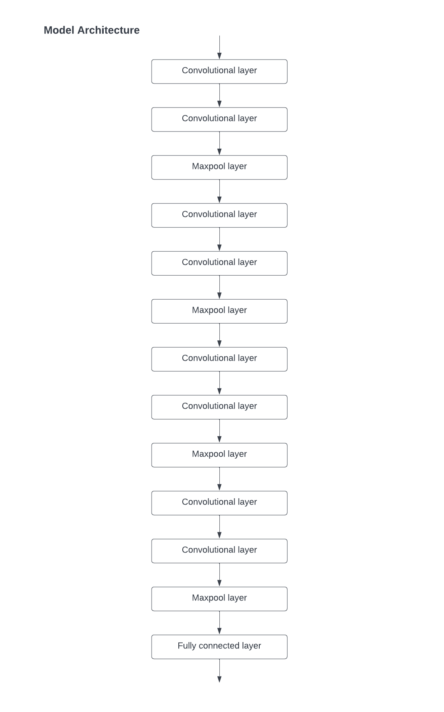
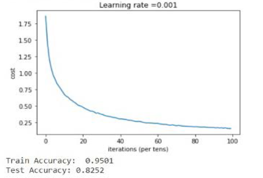

# Image-classification
A deep learning model using convolutional neural network for image classification trained on CIFAR-10 dataset.

## Contents

- [Overview](#overview)
- [Model Architecture](#model-architecture)
- [Performance](#performance)
- [Dependencies](#dependencies)

## Overview

A deep learning model for image classification implemented in `tensorlow 1.0` trained on CIFAR-10 dataset. The model architecture uses convolution layers for feature extraction. Images from 10 categories viz airplanes, cars, birds, cats, deer, dogs, frogs, horses, ships, and trucks can be recognised and classified by the model.

## Model Architecture

The model contains various convolution layers for feature extraction. The last layer contains 10 neurons (not shown in diagram) connected with previous linear layer (shown as fully connected layer in the diagram). 

## Performance

The model has accuracy of 95.01% on training set and accuracy of 82.52% on test set. 

## Dependencies

- `python == 3.8.2`
- `tensorflow == 1.0`
- `numpy == 1.19.2`
- `h5py == 3.0.0`
- `matplotlib == 3.3.3`
- `scipy == 1.5.2`
- `PIL`
- `keras == 2.4.3`
